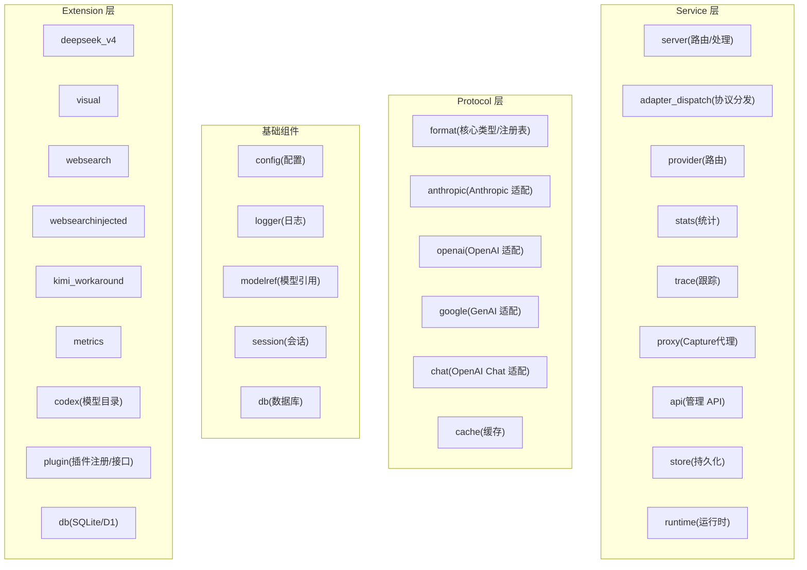
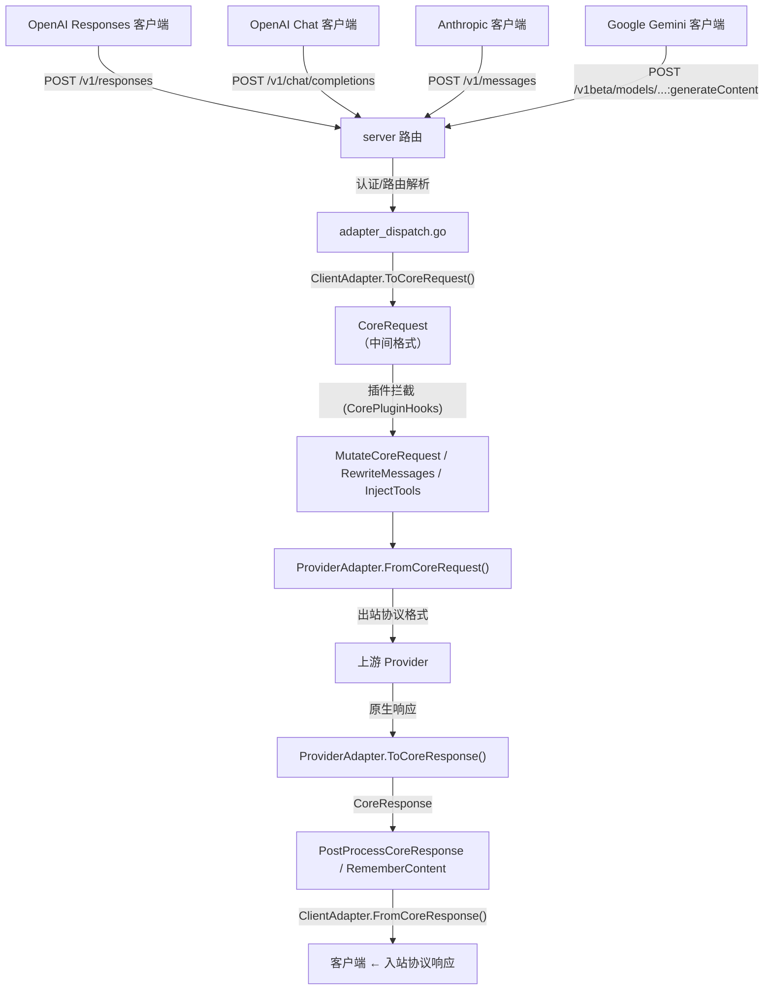

# 系统架构

## 项目概述

Moon Bridge 是一个 Go 语言编写的 HTTP 代理/协议转换服务器。对外暴露 **OpenAI Responses API**（`/v1/responses`），对内支持 **Anthropic Messages**、**Google Gemini（GenAI）**、**OpenAI Chat Completions** 四种上游协议，以及 OpenAI Responses 直通。

核心定位：让 Codex CLI（或其他 OpenAI Responses API 客户端）通过一个统一入口访问不同协议的上游 LLM Provider，无需客户端感知协议差异。

## 四层架构



### 基础组件（internal/ 顶层包）

不依赖任何 Protocol 或 Service 组件，包直接位于 `internal/` 下（无 `foundation/` 子目录）：

- `internal/config` — YAML 配置加载、校验、Schema 生成、热重载。支持 `config.schema.json` 和 `config.example.yml`
- `internal/logger` — 基于 `slog.Handler` 接口封装的日志系统，支持 consumer 模式
- `internal/modelref` — 模型引用（`model(provider)` 格式）的解析与规范化
- `internal/session` — 会话管理与上下文绑定
- `internal/db` — 数据库 Provider 注册表

### Protocol 层

协议转换核心，每个 Adapter 实现统一的 `format.ProviderAdapter` 接口（定义在 `internal/format/adapter.go`）：

- `internal/format` — 核心类型定义（`CoreRequest`、`CoreResponse`、`CoreTool`、`CoreContentBlock` 等在 `types.go`）+ Registry（`registry.go`）
- `internal/protocol/openai` — OpenAI Responses Adapter：Core ⇄ OpenAI Responses 格式
- `internal/protocol/anthropic` — Anthropic Messages Adapter：流式事件转换、工具调用映射、缓存控制
- `internal/protocol/google` — Google Gemini (GenAI) Adapter
- `internal/protocol/chat` — OpenAI Chat Completions Adapter
- `internal/protocol/cache` — Prompt 缓存规划（breakpoint 注入、TTL 管理、命中率跟踪）

### Service 层

业务编排层，组合基础层和 Protocol 组件：

- `internal/service/server` — HTTP 服务器、路由（`/v1/responses`、`/v1/models` 等）、认证
- `internal/service/server/adapter_dispatch.go` — Adapter 分发路径（switch 协议类型 → 调用对应 Adapter）
- `internal/service/provider` — Provider 管理器（多 Provider 路由、配置热重载）
- `internal/service/proxy` — Capture 模式下的透明代理
- `internal/service/app` — 应用生命周期管理（初始化、注册 Adapter、启动 HTTP 服务）
- `internal/service/api` — 管理 REST API（运行时配置 CRUD，路由在 `router.go`）
- `internal/service/stats` — 用量统计（会话级别的 token 和费用聚合）
- `internal/service/trace` — 请求跟踪（捕获请求/响应的完整链路，持久化到 `data/trace/`）
- `internal/service/store` — 配置持久化存储（SQLite / D1）
- `internal/service/runtime` — 运行时上下文

### Extension 层

可插拔的功能扩展，位于 `internal/extension/`：

- `internal/extension/deepseek_v4` — DeepSeek V4 集成（reinforce instructions、CoT 链回放）
- `internal/extension/visual` — 视觉模型任务分发（主模型不支持图像时自动路由）
- `internal/extension/websearch` — Web Search 自动模式
- `internal/extension/websearchinjected` — Web Search 注入模式
- `internal/extension/metrics` — 请求指标采集与查询
- `internal/extension/plugin` — 三方插件注册管理（`PluginRegistry` + `CorePluginHooks`）
- `internal/extension/codex` — Codex 模型目录
- `internal/extension/codex_tool_proxy` — apply_patch 代理扩展
 - `internal/extension/codextool` — Codex 自定义工具转换、namespace 工具展开与 bare action 反查
- `internal/extension/kimi_workaround` — Kimi 工具调用轮次限制
- `internal/extension/db` — 持久化 Provider（SQLite 本地 / Cloudflare D1 Worker）

## 多协议入站（any2any）

Moon Bridge 支持 **4 种入站协议 × 3 种出站协议** 的任意组合（any2any）。入站协议自动识别（通过 URL 路径和请求体格式），出站协议由 Provider 配置决定。

| 入站方向 | 端点 | SDK | 状态 |
|---------|------|-----|------|
| **OpenAI Responses** | `POST /v1/responses` | `openai.responses.create()` | ✅ 完整支持 |
| **OpenAI Chat** | `POST /v1/chat/completions` | `openai.chat.completions.create()` | ✅ 完整支持 |
| **Anthropic Messages** | `POST /v1/messages` | `anthropic.messages.create()` | ✅ 完整支持 |
| **Google Gemini** | `POST /v1beta/models/{model}:generateContent`<br/>`POST /v1beta/models/{model}:streamGenerateContent` | `google.genai.models.generate_content()` | ✅ 完整支持 |

出站方向由 Provider 配置中的 `protocol` 字段决定，支持 `anthropic`、`openai-response`、`openai-chat`、`google-genai` 四种上游协议。

## 请求生命周期数据流（any2any 模式）



每种入站协议都有自己的路由端点，但在 `adapter_dispatch.go` 内部统一为 `handleWithAdapters()` 函数，经过以下流水线：

1. **入站解码** — `ClientAdapter.ToCoreRequest(ctx, inboundReq)` → `*CoreRequest`
2. **插件拦截** — `CorePluginHooks`（MutateCoreRequest、RewriteMessages、InjectTools 等）
3. **出站编码** — `ProviderAdapter.FromCoreRequest(ctx, coreReq)` → outbound request
4. **请求上游** — HTTP 调用 Provider
5. **出站解码** — `ProviderAdapter.ToCoreResponse(ctx, rawResp)` → `*CoreResponse`
6. **插件后处理** — `CorePluginHooks`（PostProcessCoreResponse、RememberContent）
7. **入站编码** — `ClientAdapter.FromCoreResponse(ctx, coreResp)` → inbound protocol response

流式路径类似，使用 `ClientStreamAdapter` 和 `ProviderStreamAdapter` 接口，核心转换也是通过 `CoreStreamEvent` 中间格式。

## 模型路由

路由解析优先级：

1. 客户端直接指定 Provider 限定名（`model(provider)` 格式）
2. Moon Bridge `routes` 配置中的别名映射
3. Provider `offers` 列表中匹配模型名

## Provider 协议字段

每个 Provider 通过 `protocol` 字段声明上游协议：

| 值 | 上游格式 | 对应 Adapter |
|-----|----------|-------------|
| `anthropic`（默认） | Anthropic Messages API | `internal/protocol/anthropic` |
| `openai-response` | OpenAI Responses API | `internal/protocol/openai`（直通） |
| `google-genai` | Google Generative AI (Gemini) API | `internal/protocol/google` |
| `openai-chat` | OpenAI Chat Completions API | `internal/protocol/chat` |

## 适配器接口体系

所有 Adapter 实现 `internal/format/adapter.go` 中定义的四组接口，通过 `internal/format/registry.go` 中的 `Registry` 管理注册：

### 入站适配器（Client 侧）

```go
type ClientAdapter interface {
    ClientProtocol() string
    DecodeRequest(r *http.Request) (any, error)
    ToCoreRequest(ctx context.Context, req any) (*CoreRequest, error)
    FromCoreResponse(ctx context.Context, resp *CoreResponse) (any, error)
}

type ClientStreamAdapter interface {
    ClientProtocol() string
    DecodeRequest(r *http.Request) (any, error)
    ToCoreRequest(ctx context.Context, req any) (*CoreRequest, error)
    FromCoreStream(ctx context.Context, respChan <-chan CoreStreamEvent) (<-chan any, error)
}
```

### 出站适配器（Provider 侧）

```go
type ProviderAdapter interface {
    ProviderProtocol() string
    FromCoreRequest(ctx context.Context, req *CoreRequest) (any, error)
    ToCoreResponse(ctx context.Context, resp any) (*CoreResponse, error)
}

type ProviderStreamAdapter interface {
    ProviderProtocol() string
    FromCoreRequest(ctx context.Context, req *CoreRequest) (any, error)
    ToCoreStream(ctx context.Context, upstream io.ReadCloser) (<-chan CoreStreamEvent, error)
}
```

### 入站协议对比

各协议在工具调用编码上的关键差异：

| 协议 | 工具调用表示 | 工具结果表示 | 工具调用是否有 ID |
|------|------------|------------|----------------|
| OpenAI Responses | `output` 中 `function_call` 条目 | `function_call_output` 条目 | ✅ 有 `call_id` |
| OpenAI Chat | 消息中的 `tool_calls` 字段 | `role: "tool"` 消息 | ✅ 有 `tool_call_id` |
| Anthropic Messages | `content` 中 `tool_use` 块 | `tool_result` 内容块 | ✅ 有 `id` |
| Google Gemini | `parts` 中 `functionCall` | `functionResponse` | ❌ **无 ID，仅按名称匹配** |

> Google Gemini 的 `FunctionCall` 没有 ID 字段，工具调用与结果通过函数名关联。Moon Bridge 在 Google 入站适配器中通过两遍扫描为每个 `FunctionCall` 分配唯一 ID（格式 `toolu_gemini_<name>_<n>`），并在匹配的 `FunctionResponse` 中使用同一 ID，确保上下游的 tool_call_id 一致。

### 跨协议工具调用

协议间工具调用的核心挑战在于格式差异。Moon Bridge 的 `CoreTool` / `CoreContentBlock` 作为中间表示屏蔽差异：

- **Anthropic** → `tool_use` / `tool_result` content blocks
- **OpenAI Response** → `function_call` / `function_call_output` items
- **OpenAI Chat** → `tool_calls` / `tool` role messages
- **Google Gemini** → `functionCall` / `functionResponse` parts

### Namespace 工具与 Bare Action 恢复

Codex CLI 的 namespace 工具（如 `multi_agent_v1`）将多个 action 包裹在一个上游工具名下。部分模型（如 DeepSeek V4 Flash）会直接发出裸 action 名称（`spawn_agent`），而非 wrapper 名称。

`internal/extension/codextool` 包的 `ToolMap` 从 flattened `CoreTool` 列表构建反向映射表，通过 `Actions []string` 字段记录每个 namespace wrapper 下声明的 action 列表。当 provider 返回裸 action 时，`LookupNamespaceAction` 只在无歧义时恢复 `ToolNamespace`；若存在同名顶层工具，精确匹配优先。此机制覆盖全部四种上游协议。

### Web Search 工具注入

`InjectWebSearchTool`（定义在 `internal/service/server/server.go`）在 Transform 模式下动态注入 `web_search` 工具到请求中。支持 `auto` / `enabled` / `disabled` / `injected` 四种模式。注入式搜索在 `adapter_dispatch.go` 中通过 `websearchinjected.WrapProvider()` 包装上游 Provider 实现自动编排。

## 缓存系统

通过 `internal/protocol/cache` 实现 Anthropic Messages API 的 prompt 缓存。支持 `off` / `explicit` / `automatic` / `hybrid` 四种模式，可配置 TTL、最小缓存 token 数、breakpoint 上限等。

## 请求跟踪系统

请求跟踪通过 `internal/service/trace` 和 `internal/service/server/trace` 实现。跟踪文件按 `session/模型名/类别/序号.json` 组织，每条记录包含完整请求/响应数据，支持 Chat、Response、Anthropic 三个分类目录。

## 管理 API

当 `persistence.active_provider` 启用时（SQLite 或 D1），管理 API 在 `/api/v1/` 下可用（路由在 `internal/service/api/router.go`）：

| 端点 | 方法 | 功能 |
|------|------|------|
| `/api/v1/config` | GET/PUT | 获取/更新运行时配置 |
| `/api/v1/models` | GET | 列出配置中的模型定义 |
| `/api/v1/models/{slug}` | GET/PUT/DELETE | 管理模型定义 |
| `/api/v1/providers` | GET/POST/DELETE | 管理 Provider |
| `/api/v1/providers/{key}/offers/{model}` | PATCH/DELETE | 管理 Provider 模型报价 |

此外，启用 metrics extension 后会注册 `/v1/admin/metrics` 端点提供请求指标查询。

Codex TOML 配置通过 CLI 标志 `-print-codex-config <model>` 生成，非 API 端点。
